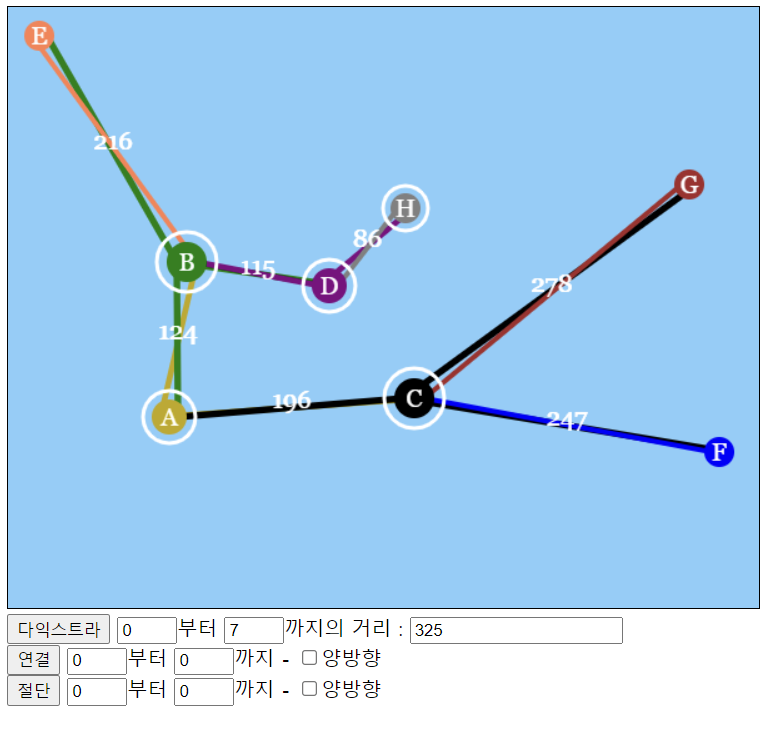

# 그래프 알고리즘 시각화

## 구성요소
- 그래프
	- 노드
		- 링크
- 마우스
- 캔버스

## 진행 상황
### 완료
- 캔버스에 그래프 그리기
- 마우스로 노드 위치 움직이기
- 다익스트라 알고리즘으로 a에서 b까지 최단거리 구하기
- 탐색이 완료되는 순서대로 인터벌을 두고 표시하기
- 노드 간 연결, 절단, 알고리즘 실행 인터페이스 구현하기
- 웹서버에서 js파일 get요청 따로 되어있는 것 express.static.으로 처리하기
- 링크 랜덤하게 섞기
- 노드 추가/제거
### 진행중
- 임계 경로 표시하기
- 연결, 절단의 숫자를 캔버스에 있는 문자로 표기하기

## 발생한 문제 및 해결법
- 문제: exports is not defined
	- 원인: tsconfig에서  target과 module의 설정이 웹 브라우저에서 동작할 때와 node에서 동작할 때 차이가 있다
	- 해결: target:"es2015", module:"es2015"로 수정
- 문제: 웹 서버를 가동하기 위한 ts-node가 안됨
	- 원인: node의 설정으로 컴파일되어야 하는 app.ts가 웹브라우저를 대상으로 하는 설정으로 적용됨
	- 해결: 웹서버를 위한 tsconfig를 별도로 만들고 ts-node 실행 시 --project tsconfig-erver.json을 추가해서 별도의 컴파일 규칙을 따르도록 함
- 문제: ts에서 컴파일된 js파일에서 import할 때 404 문제 발생
	- 해결: ts파일의 import 부분에서 "from '*.js'" 사용 -> 문제 발생하지 않음